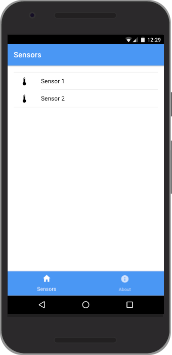
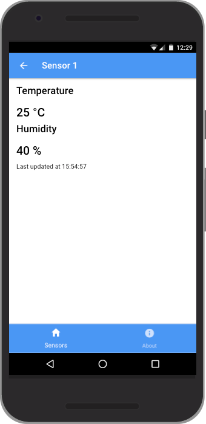

# Sensor UI
A little Ionic 2 mobile application to track your ESP8266-DHT11 sensor data.
This project has direct dependencies to [sensor-srv](http://github.com/steviee/sensor-srv) and [sensor-esp](http://github.com/steviee/sensor-esp).

...aaaand this is work-in-progress!

## Development
In order to compile and run this app on your phone, you need a recent [Ionic 2](http://ionicframework.com) version installed.

To serve locally you just need to call `ionic serve` or `inonic serve -p android` (please forgive my IOS ignorance for now :grin: ).

To deploy to your device you need to have ADB running and your device shown in `adb devices`. Just run `ionic run android` whereafter the app should start on your phone (and stay there). You can also manually copy the .apk file from the build folder to your phone.

Please be aware that this is the first ever Ionic/Angular2 app so if you feel the need to point out some issues with this code I would be very glad to go over them and learn in the process. Thank you!

## Roadmap
These things are on my list. Feel free to change this list or create an issue.

- [ ] Add user authentication
- [ ] Add charts for recent sensor readings
- [ ] Add dashboard page to show all sensors current reading

## What now?

Do whatever you like with this.
